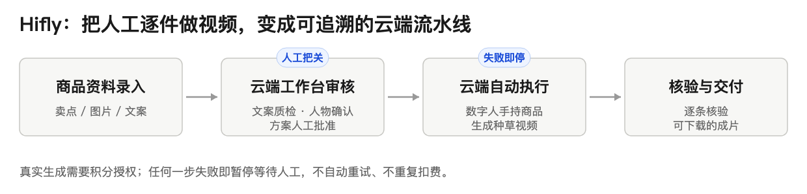
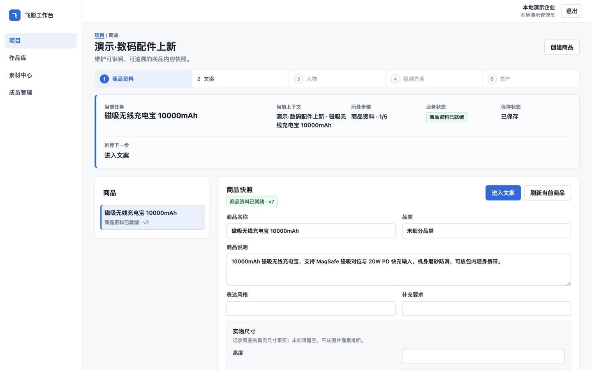
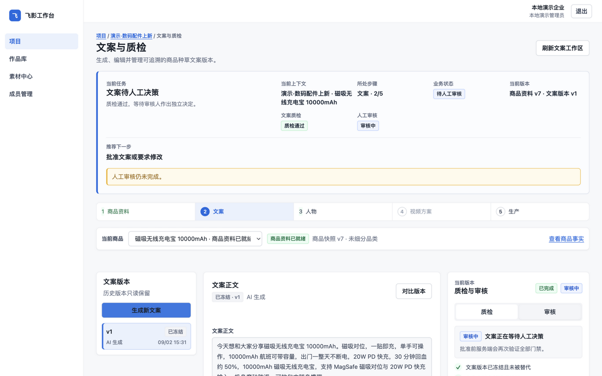
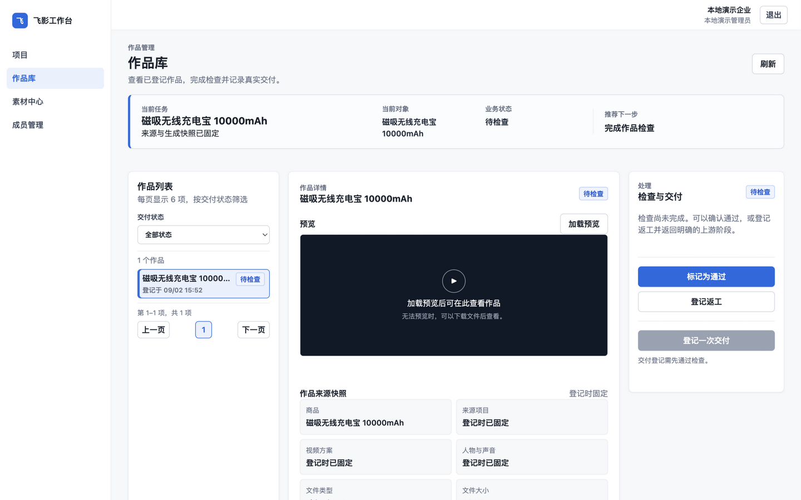

<div align="center">

# Hifly｜电商数字人视频云端生产工作台

**把"逐件上传、等待、下载"的人工视频生产，变成可追溯的云端流水线。**

[](https://github.com/JettxonHo/hifly-hands-on-product-batch/actions/workflows/ci.yml)


[本地演示](#快速开始) · [运营手册](docs/新人培训使用手册.html) · [运维 Runbook](docs/deployment/ALIYUN_CLOUD_EXECUTOR_CE07_RUNBOOK.md) · [Issues](https://github.com/JettxonHo/hifly-hands-on-product-batch/issues)

</div>

> 这个项目回答的问题：**AI 自动化进入真实生产环境，怎么保证不出事、不乱花钱？**

## 目录

- [它是什么](#它是什么)
- [功能特性](#功能特性)
- [真实运行界面](#真实运行界面)
- [验证状态](#验证状态)
- [它和其他自动化工具的区别](#它和其他自动化工具的区别)
- [快速开始](#快速开始)
- [常见问题](#常见问题)

## 它是什么

这是一个**有偿电商合作项目**。合作方原本在飞影平台逐件手工上传商品、等待数字人视频生成、再逐件下载。本项目把这条人工链路收敛为一个云端工作台：运营只负责录入与审核，云端执行器（Cloud Executor）通过 Playwright 自动完成上传、生成与下载，每条成片经 A12 核验后登记交付。

生产主路径是 Cloud Control Plane + Cloud Executor，运营在任意电脑通过浏览器操作；本地工作台仅保留为开发演示与故障回退。



## 功能特性

- **商品批量录入**：CSV / XLSX 批量导入 + 多图自动匹配，或单件表单录入
- **文案流水线**：AI 生成 → 质量评估 → 人工审核，三层分开留痕
- **人物与方案确认**：数字人形象与视频方案均需人工批准后才进入生产
- **一商品一工单**：严格串行领取与执行，失败即停、不自动重试
- **核验与交付**：成片自动核验（A12）后进入作品库，提供鉴权预览与下载
- **成本守门**：真实生成消耗真实积分，执行前必须取得授权；Provider 调用「最多一次」
- **本地演示模式**：一条命令起全链路演示，不触飞影、不产生任何费用

## 真实运行界面

| 单任务工作区 | 文案质检与人工审核 | 作品库 |
|---|---|---|
|  |  |  |

截图为本地演示链路实跑（不触飞影、不产生真实费用），与下方生产试运行记录是两类事实。

## 验证状态

> 截至 2026-09-02，与 `docs/status/` 治理记录口径一致。

| 验证 | 状态 |
|---|---|
| 云端真实链路试运行 | 3 个商品严格串行：每单 1 次成功执行、1 次核验通过、 1 个作品登记，0 重试 / 0 重复提交；成片校验一致，重启后可下载 |
| 生产环境部署纪律 | 幂等创建键经独立评审与 CI 后受控部署至阿里云生产环境：部署前备份、回滚标签、部署后只读核对；一次维护脚本故障透明记录并恢复 |
| 成本控制合同 | 文案质量评估 Provider「最多一次」调用；崩溃 / 重复执行均 fail-closed，费用未知态显式表达而非猜测 |
| 真实批次试点 | 5 个 SKU 校准冻结（积分上限 6000、严格串行、禁止自动重试）；未获授权前真实批次保持阻断 |

## 它和其他自动化工具的区别

- **失败即停**：任何一步失败立即暂停等待人工，不自动重试、不重复扣费
- **成本是硬约束**：授权、上限、串行、费用未知态都是一等公民，而不是事后对账
- **工程绿灯 ≠ 生产验收**：测试通过不冒充真实运行，真实运行有独立的授权与证据链

## 快速开始

前置条件：Node.js 18+；本地演示另需 Docker Desktop。

```bash
npm install
npm run demo   # A01–A14 全链路本地演示，自动打开浏览器
```

演示使用受控假执行器与演示数据库，不读取飞影登录态、不调用真实 Provider、不产生费用。生产部署见 `docs/deployment/`。

## 常见问题

**会乱扣飞影积分吗？**
不会。真实生成必须取得显式授权，且有积分硬上限、严格串行与失败即停；未获授权前真实批次保持阻断状态。

**运营需要安装开发环境吗？**
不需要。生产环境只需浏览器访问云端地址；Node.js 只用于本地开发与演示。

**页面改版了怎么办？**
网页自动化依赖飞影页面结构，遇到页面改版、登录失效或验证码时系统会暂停并记录失败，等待人工处理，不会盲目重试。

---

> 以下为运营与开发文档（原 README 内容保留不变，从"## 当前生产工作流"开始）

## 当前生产工作流

1. 运营通过云端 HTTPS 登录企业工作台。
2. 完成商品事实、文案生成/QC/审核、人物确认和 VideoPlan 审核。
3. 创建一商品一工单的生产任务，并确认 Cloud Executor 在线、登录态与存储就绪。
4. Cloud Executor 严格串行领取工单，进入飞影「手里有货」完成上传、提交和下载。
5. 系统保存云端视频，完成 A12 核验并在 Work 中提供鉴权预览和下载。
6. 真实生成必须有对应积分授权；首失败即停，不自动重试。

云端飞影登录只通过 SSH tunnel + loopback noVNC 完成，Profile、Token、素材、下载、日志和截图不会进入 Git。`LOCAL_AGENT_ENABLED=false` 是当前生产默认值。

## 生产入口

普通运营只需浏览器和云端 HTTPS 地址，不需要安装 Node.js、Playwright 或 Local Agent。部署和 Cloud Executor 运维见 `docs/deployment/ALIYUN_CLOUD_EXECUTOR_CE07_RUNBOOK.md`。

## Legacy 本地开发入口

以下命令只用于开发、演示和故障回退，不作为当前生产流程：

```bash
npm install
npx playwright install chromium
cp config.example.json config.local.json
npm run login
npm run gui
```

登录步骤会弹出本地浏览器；其 Profile 与云端 Cloud Executor Profile 相互独立，不能用来证明纯云端系统就绪。

如果默认端口被占用，工作台会自动选择下一个可用端口，并在终端打印类似：

```bash
Local workbench: http://127.0.0.1:4318
```

## A01-A14 本地全链路演示

只想查看企业内容生产闭环时，可使用不读取 `config.local.json`、不读取飞影登录态的本地演示：

```bash
npm run demo
```

该命令需要 Docker Desktop，使用独立的 PostgreSQL 容器（loopback 端口从 `55433` 起自动选择、独立 Compose project 和 volume），按 A01→A14 顺序执行 migration，启用完整企业功能，并打开 `http://127.0.0.1:<port>/login.html`。演示数据默认保存在项目 `.local-demo/`，不会因系统清理临时目录而丢失。演示使用仓库现有 controlled provider/evaluator 和 fake executor；真实 Provider、Capture HTTP、Playwright、影刀和飞影积分均不会被调用。旧工作台的生成按钮在演示中也只会落到 fake executor。

固定的本地测试凭据如下，仅用于演示：

```text
账号：demo-admin@demo.local
临时密码：Demo-Local-2026-Only!
```

首次登录会强制设置新密码；后续重启请使用你设置的新密码，忘记时可执行下方 reset 后重新初始化。请勿把该凭据当作生产密码。停止演示数据库但保留数据：

```bash
npm run demo:stop
```

只有明确需要重置演示数据库时才运行 `npm run demo:reset`；该命令只删除演示专用 PostgreSQL volume，不触碰 `docker-compose.identity.yml` 的测试库，也不删除 `.local-demo/` 中的本地素材文件。

## Legacy 本地工作台能力

- 单条商品录入：填写 SKU、产品名称、核心卖点、品类并上传商品图。
- 批量导入：上传 CSV/XLSX 和多张商品图，系统按 `sku`、显式图片名或文件名自动匹配。
- 待执行任务：查看批次、任务状态和确认生成动作。
- 运行记录：显示导入、校验、开始生成和错误信息。
- 安全边界：同源请求令牌、Host/Origin 校验、上传文件类型/大小/像素限制、全局执行锁和幂等 key。

## CSV/XLSX 字段

| 字段 | 必填 | 说明 |
| --- | --- | --- |
| `sku` | 建议 | 唯一编号；留空时 GUI 会自动生成。 |
| `product_name` | 是 | 产品名称或视频展示名。 |
| `selling_points` | 是 | 核心卖点，建议用分号分隔。 |
| `category` | 否 | 用于匹配人物素材池，如 `beauty`、`fresh_food`。 |
| `image_path` | 是 | 在 GUI 中填写上传文件名；CLI 中填写本地相对路径。 |
| `person_image_path` | CLI 可选 | GUI 不接受客户本机路径；CLI 可用本地人物池或显式路径。 |
| `status` | CLI 可选 | 新任务使用 `pending`。 |

## 人物和背景差异化

当前飞影「手里有货」页面没有暴露数字人姿势参数。坐姿、站姿、景别和背景主要由上传人物图或飞影推荐模板决定。要避免批量视频过于雷同，建议按品类准备多张人物/背景图：

```text
assets/person_pool/fresh_food/
assets/person_pool/beauty/
assets/person_pool/snacks/
assets/person_pool/default/
```

优先级为：商品表显式人物图、同品类人物池、默认人物池、飞影推荐人物。GUI 当前主打客户上传商品图和商品信息；人物池由运营在项目目录中维护。

## 命令

| 命令 | 用途 |
| --- | --- |
| `npm run gui` | 启动 legacy Mac/Windows 本地网页工作台，仅用于开发/回退。 |
| `npm run demo` | 启动不访问飞影的 A01-A14 企业本地演示并打开登录页。 |
| `npm run demo:stop` | 停止演示 PostgreSQL，保留演示数据。 |
| `npm run demo:reset` | 显式删除演示 PostgreSQL 的专用 volume；保留 `.local-demo/` 文件。 |
| `npm run login` | 保存 legacy 本地 Profile；不会配置云端 Cloud Executor。 |
| `npm run validate` | 校验传统 `products/products.csv` 输入。 |
| `npm run prepare-standard` | 按每商品 1 条标准视频生成口播脚本、飞影提示词和质检表。 |
| `npm run run` | 使用 CLI 路径批量跑 `products/products.csv`。 |
| `npm test` | 运行单元和集成测试；默认使用假执行器，不访问飞影。 |
| `npm run check` | 运行 JavaScript 语法检查。 |
| `npm run package` | 生成交付包 `outputs/hifly-hands-on-product-batch.tar.gz`。 |

`npm run prepare-standard` 的默认输出目录：

```text
outputs/standard-video-assets/
  scripts/
  prompts/
  qc/qc_report.csv
```

## 关键限制

网页自动化依赖飞影页面结构。当前页面流程已校准为：外层点击「上传人物+产品图」打开弹窗，弹窗中选择推荐人物图或上传人物图，上传商品图，点击弹窗「立即生成」，生成完成后必须点击「确认」，再回外层点击「立即生成」创建视频，最后从作品入口下载结果。

遇到登录失效、验证码、按钮文案变化、页面改版、任务排队、积分不足或下载入口变化时，自动化会暂停或记录失败，需要人工处理后重跑。

真实批次按 RBV 校准冻结推进：首轮固定 5 个 SKU、积分上限 6000（每 SKU 1200）、严格串行、禁止自动重试；扩大批次须以首轮校准证据为前提，并经独立评审与 Owner 授权。见 `docs/status/RBV_CALIBRATION_READINESS_FREEZE.md`。

## 交付文档

- `docs/新人培训使用手册.html`：给客户和运营共同使用的离线培训手册。
- `docs/ENVIRONMENT.md`：安装、启动、打包和 GitHub 发布前检查。
- `docs/SOP.md`：运营 SOP 与质检规则。
- `docs/飞影标准视频工作流.md`：每个商品 1 条标准视频的项目生产链路。
- `docs/飞影提示词模板.md`：飞影左右分屏画面提示词、口播模板和负面提示词。
